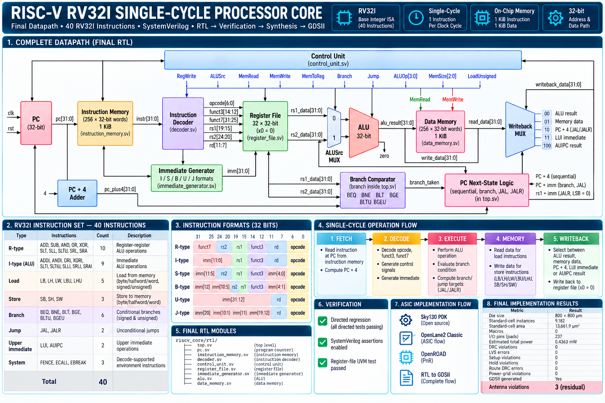
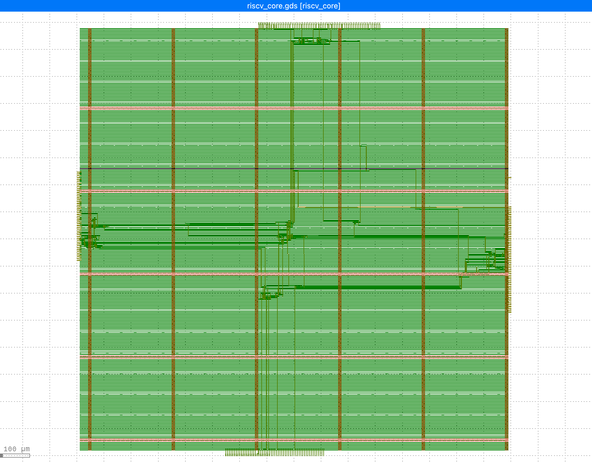
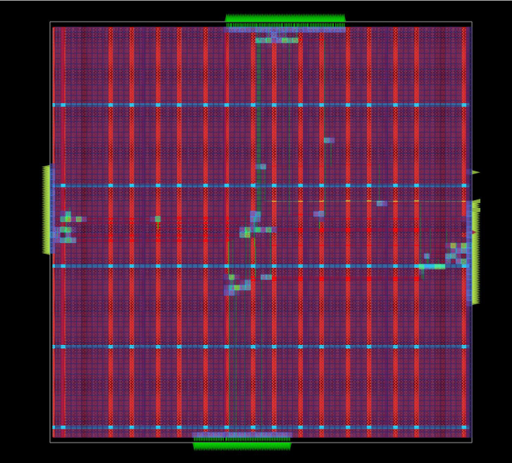
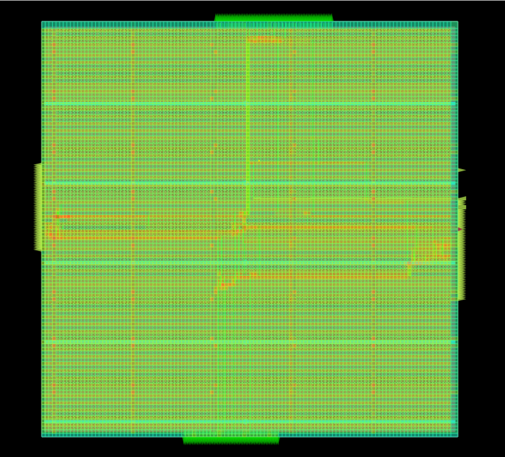
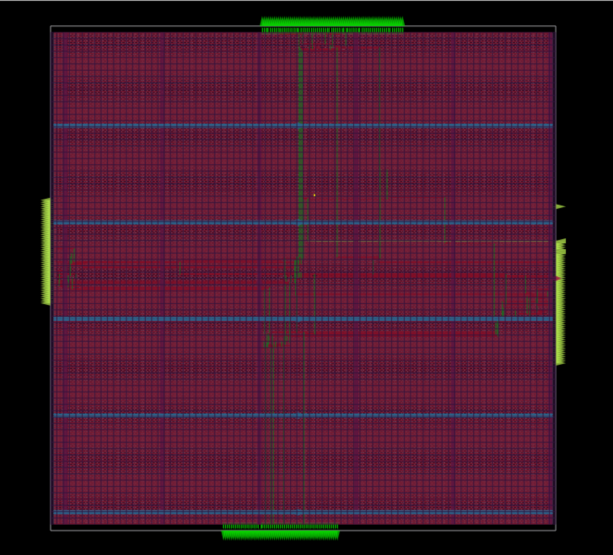
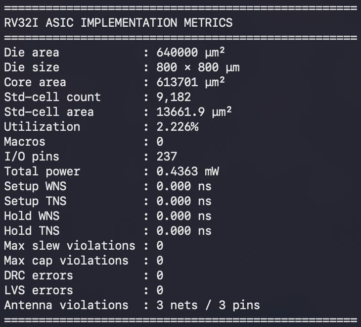

# RISC-V RV32I Single-Cycle Processor

A SystemVerilog implementation of a **32-bit RISC-V RV32I single-cycle
processor**, taken from RTL design through simulation, verification,
synthesis, physical design, and GDSII generation using an open-source
ASIC flow.

The processor supports the **40 unique instructions of the RV32I base
integer ISA**. `ECALL` and `EBREAK` are decode-supported without a
CSR/trap subsystem, while `FENCE` has NOP behavior in this simple
single-core implementation.

------------------------------------------------------------------------

## Architecture



The processor implements a single-cycle datapath containing:

-   32-bit Program Counter
-   32-bit instruction path
-   256 × 32-bit instruction memory (1 KiB)
-   Instruction decoder
-   32 × 32-bit register file
-   Immediate generator
-   32-bit ALU
-   Branch comparator
-   256 × 32-bit data memory (1 KiB)
-   Writeback selection logic
-   Branch and jump target logic
-   Centralized control unit

Register `x0` is hardwired to zero.

------------------------------------------------------------------------

## RV32I Instruction Support

The implemented decode/execute path covers all 40 unique RV32I
instructions:

  ------------------------------------------------------------------------
  Category              Instructions                                 Count
  --------------------- --------------------- ----------------------------
  R-Type                ADD, SUB, AND, OR,                              10
                        XOR, SLT, SLL, SLTU,  
                        SRL, SRA              

  I-Type ALU            ADDI, ANDI, ORI,                                 9
                        XORI, SLTI, SLTIU,    
                        SLLI, SRLI, SRAI      

  Load                  LB, LH, LW, LBU, LHU                             5

  Store                 SB, SH, SW                                       3

  Branch                BEQ, BNE, BLT, BGE,                              6
                        BLTU, BGEU            

  Jump                  JAL, JALR                                        2

  Upper Immediate       LUI, AUIPC                                       2

  System                FENCE, ECALL, EBREAK                             3

  **Total**                                                         **40**
  ------------------------------------------------------------------------

### Memory Operations

The data memory supports:

-   Byte loads and stores
-   Halfword loads and stores
-   Word loads and stores
-   Signed loads
-   Unsigned loads

### Control Flow

The processor supports:

-   `BEQ`
-   `BNE`
-   `BLT`
-   `BGE`
-   `BLTU`
-   `BGEU`
-   `JAL`
-   `JALR`

`JAL` and `JALR` write `PC + 4` to the destination register. `JALR`
clears bit 0 of the computed target address.

### System Instructions

-   `FENCE` is decode-supported and behaves as a NOP in this simple
    single-core design.
-   `ECALL` and `EBREAK` are decode-supported.
-   No CSR or trap/privileged-mode subsystem is implemented.

------------------------------------------------------------------------

## RTL Design

The processor is implemented using modular SystemVerilog RTL.

### RTL Modules

``` text
rtl/
├── alu.sv
├── control_unit.sv
├── data_memory.sv
├── decoder.sv
├── immediate_generator.sv
├── instruction_memory.sv
├── pc.sv
├── register_file.sv
└── top.sv
```

### Module Responsibilities

  Module                     Responsibility
  -------------------------- -------------------------------------------------------
  `top.sv`                   Top-level processor datapath and control integration
  `pc.sv`                    Program counter
  `instruction_memory.sv`    Instruction storage and instruction fetch
  `decoder.sv`               Instruction field extraction
  `control_unit.sv`          Instruction decoding and control generation
  `register_file.sv`         32 × 32-bit register file with `x0` protection
  `immediate_generator.sv`   I/S/B/U/J immediate generation
  `alu.sv`                   Arithmetic, logical, comparison, and shift operations
  `data_memory.sv`           Load/store memory subsystem

------------------------------------------------------------------------

# Verification

The design was verified using RTL simulation, linting, SystemVerilog
Assertions, directed tests, and a focused UVM register-file environment.

## Icarus Verilog

**Icarus Verilog** is used for RTL simulation and execution of the
directed regression.

The directed tests cover:

-   Arithmetic instructions
-   Immediate ALU instructions
-   Signed comparisons
-   Register-file corner cases
-   Register-register shifts
-   Immediate shifts
-   Branch instructions
-   `JAL`
-   `JALR`
-   `LUI`
-   `AUIPC`
-   Memory operations
-   Byte/halfword/word accesses
-   System instructions

The complete directed regression passes.

The repository includes the test programs and directed testbenches
under:

``` text
programs/
tb/directed/
run_regression.sh
```

## Verilator

**Verilator** is used for RTL linting and additional simulation checks.

Final lint status:

-   **Lint errors:** 0
-   **Lint warnings:** 442

## SystemVerilog Assertions

Assertions were enabled during verification to check key processor
properties including:

-   `x0` remains zero
-   Correct branch target calculation
-   Normal sequential PC progression
-   JAL target calculation
-   JALR target calculation
-   Jump writeback of `PC + 4`
-   LUI writeback
-   AUIPC writeback
-   No unintended side effects from system instructions

## UVM

A focused UVM environment was implemented for the register file.

The UVM test verifies:

-   Register writes
-   Register reads
-   `x0` write protection
-   Preservation of existing register values

The register-file UVM test completed successfully with:

-   **UVM errors:** 0
-   **UVM fatal errors:** 0

The UVM environment is located under:

``` text
tb/uvm_regfile/
```

------------------------------------------------------------------------

# ASIC Implementation

The processor was taken through an open-source RTL-to-GDSII
implementation flow using the Sky130 PDK.

## Toolchain

  Stage                              Tool
  ---------------------------------- --------------------------
  RTL                                SystemVerilog
  RTL Simulation                     Icarus Verilog
  RTL Lint / Additional Simulation   Verilator
  Assertions                         SystemVerilog Assertions
  Register-File Verification         UVM
  Logic Synthesis                    Yosys
  ASIC Flow                          OpenLane2 Classic
  Physical Design                    OpenROAD
  PDK                                Sky130
  GDSII Inspection                   KLayout

### RTL-to-GDSII Flow

``` text
SystemVerilog RTL
       │
       ▼
Icarus Verilog / Verilator
       │
       ▼
RTL Verification
       │
       ▼
Yosys Synthesis
       │
       ▼
OpenLane2 Classic
       │
       ├── Floorplanning
       ├── Power Distribution Network
       ├── Placement
       ├── Clock Tree Synthesis
       ├── Global Routing
       ├── Detailed Routing
       └── Physical Verification
       │
       ▼
OpenROAD
       │
       ▼
GDSII
       │
       ▼
KLayout
```

------------------------------------------------------------------------

# Physical Design

The final design was implemented with **Sky130** using **OpenLane2
Classic** and **OpenROAD**.

## Final GDSII Layout



The generated GDSII was inspected in **KLayout** to visualize the final
physical layout and routing layers.

## Placement Density



OpenROAD placement-density visualization showing the distribution of
placed standard cells across the implemented design.

## Routing Congestion



OpenROAD routing-congestion visualization showing routing demand across
the design.

## Power Density



OpenROAD power-density visualization of the implemented design.

------------------------------------------------------------------------

# Final Implementation Metrics



  Metric                               Result
  ---------------------------- --------------
  Technology                           Sky130
  Die Size                       800 × 800 µm
  Standard-Cell Instances               9,182
  Standard-Cell Area             13,661.9 µm²
  Standard-Cell Utilization             2.23%
  Macros                                    0
  I/O Pins                                237
  Total Estimated Power             0.4363 mW
  Setup Violations                          0
  Hold Violations                           0
  Max Slew Violations                       0
  Max Capacitance Violations                0
  Route DRC Errors                          0
  Power Grid Violations                     0
  DRC Errors                                0
  LVS Errors                                0
  GDSII                             Generated

### Timing

At nominal TT conditions:

-   Setup WNS: `0 ns`
-   Setup TNS: `0 ns`
-   Hold WNS: `0 ns`
-   Hold TNS: `0 ns`
-   Setup worst slack: `6.253689 ns`
-   Hold worst slack: `0.330628 ns`

### Physical Verification

Final physical verification reports:

-   **DRC errors:** 0
-   **LVS errors:** 0
-   **Route DRC errors:** 0
-   **Power-grid violations:** 0

There are **3 residual antenna violations** in the final implementation.
Antenna repair inserted antenna diodes, but three antenna violations
remained. The design was not rerun after this point.

------------------------------------------------------------------------

# Repository Structure

``` text
RISCV-RV32I/
├── docs/
│   ├── rv32i_architecture.png
│   ├── final_gds_layout.png
│   ├── placement_density.png
│   ├── routing_congestion.png
│   ├── power_density.png
│   └── metrics.jpeg
│
├── rtl/
│   ├── alu.sv
│   ├── control_unit.sv
│   ├── data_memory.sv
│   ├── decoder.sv
│   ├── immediate_generator.sv
│   ├── instruction_memory.sv
│   ├── pc.sv
│   ├── register_file.sv
│   └── top.sv
│
├── tb/
│   ├── directed/
│   └── uvm_regfile/
│
├── programs/
│   └── *.hex
│
├── openlane/
│   └── riscv_core/
│       └── config.json
│
├── run_regression.sh
└── README.md
```

Generated implementation runs, tool-generated build artifacts, and
third-party verification infrastructure are intentionally excluded from
the repository.

------------------------------------------------------------------------

# Running the Directed Regression

From the repository root:

``` bash
./run_regression.sh
```

The regression executes the directed processor tests using the RTL
simulation environment.

The expected final result is:

``` text
ALL DIRECTED TESTS PASSED
```

------------------------------------------------------------------------

# OpenLane2 Configuration

The repository contains the OpenLane2 configuration used for the ASIC
implementation:

``` text
openlane/riscv_core/config.json
```

The configuration defines:

-   Top-level design: `riscv_core`
-   RTL source files
-   Clock port
-   Clock period
-   Physical die sizing

The final implementation used an `800 × 800 µm` die to accommodate the
large number of top-level debug ports exposed by the current top-level
design.

------------------------------------------------------------------------

# Implementation Status

The completed project demonstrates the complete path from
**SystemVerilog RTL to a generated Sky130 GDSII layout**, including:

-   RV32I processor RTL
-   Directed RTL verification
-   Verilator linting
-   SystemVerilog Assertions
-   UVM register-file verification
-   Yosys synthesis
-   OpenLane2 Classic implementation
-   OpenROAD physical design
-   KLayout GDSII inspection
-   DRC verification
-   LVS verification
-   Timing analysis
-   GDSII generation

The final implementation is **DRC-clean, LVS-clean, and timing-clean**,
with the noted **3 residual antenna violations**.

------------------------------------------------------------------------
